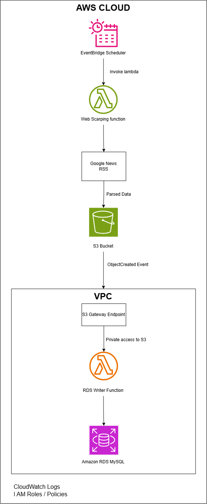
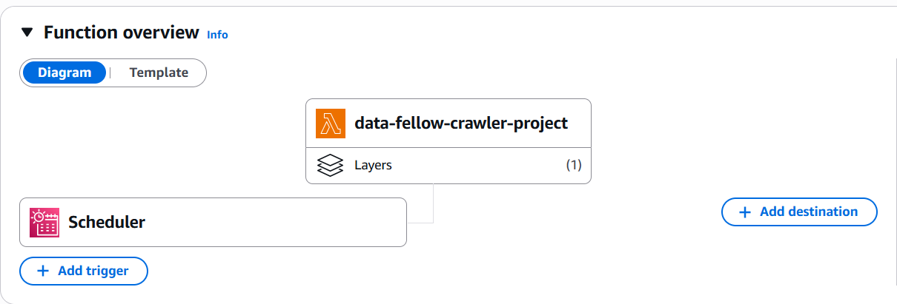
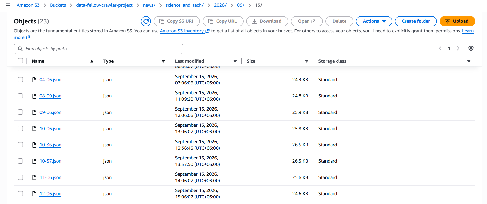
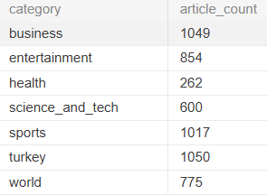
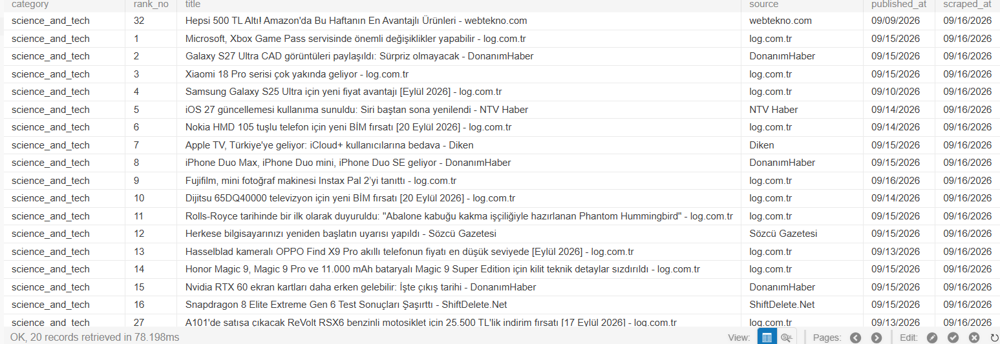
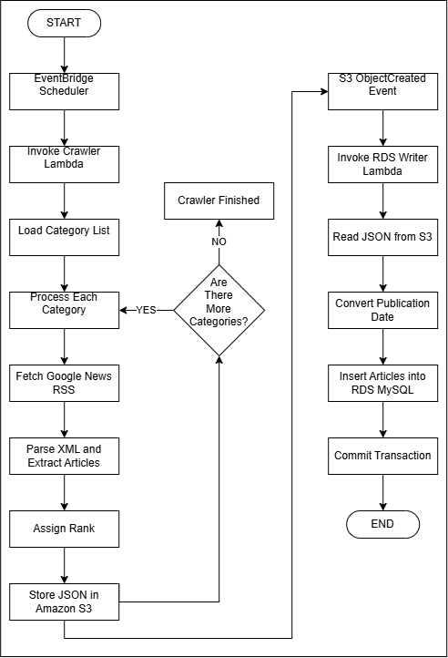

# AWS Üzerinde Otomatik Google News Verisi Toplama Projesi

## Giriş

Bu projede Google News sitesindeki farklı haber kategorilerinden verileri otomatik olarak toplayan, bu verileri düzenleyen ve AWS servisleri üzerinde  saklayan bir sistem geliştirilmiştir. Bu projenin amacı cloud computing, AWS servislerinin kullanımı, ilişkisel veritabanı ve veri depolama konularını gerçek bir senaryo üzerinden uygulamalı olarak deneyimlemektir. Sistem saatlik olarak çalışmakta ve Google News RSS kaynaklarından haber verilerini toplamaktadır. Toplanan veriler önce JSON formatında Amazon S3 üzerine kaydedilmekte, ardından S3 üzerinde yeni bir dosya oluştuğunda ikinci bir Lambda fonksiyonu tetiklenerek veriler Amazon RDS MySQL veritabanına aktarılmaktadır. Bu proje sonunda tamamen otomatik çalışan bir veri toplama ve depolama pipeline'ı oluşturulmuştur. 

## Veri Toplama Yaklaşımının Belirlenmesi

Projenin ilk aşamasında Google News üzerindeki haber verilerinin klasik HTML tabanlı web scraping yöntemiyle toplanması denendi. Bu yöntemde `requests` ile web sayfasına istek gönderiliyor ve `BeautifulSoup` kullanılarak HTML içerisindeki haber bağlantıları ve başlıkları ayrıştırılıyordu. Local ortamda bu yöntem çalışmasına rağmen, uygulama AWS Lambda üzerinde çalıştırıldığında Google News haber sayfası yerine consent sayfası döndürmeye başladı. Farklı `User-Agent`, dil ve session ayarları denenmesine rağmen bu davranış çözülemedi. Bu nedenle projede HTML scraping yaklaşımı bırakılarak Google News RSS kaynaklarının kullanılmasına karar verildi. RSS yapısı haberleri XML formatında sunduğu için başlık, kaynak, yayın tarihi ve bağlantı gibi bilgilere daha düzenli ve güvenilir şekilde erişmek mümkün oldu. Bundan sonraki veri toplama süreci RSS feed'lerinin alınması ve XML verisinin parse edilmesi üzerine kuruldu.

## RSS Üzerinden Haber Verilerinin Toplanması

HTML tabanlı scraping yaklaşımında yaşanan problem sonrasında veri kaynağı olarak Google News RSS feed'leri kullanılmaya başlandı. RSS, web sitelerinin içeriklerini yapılandırılmış XML formatında sunmasını sağlayan bir yöntemdir. Google News RSS yapısı sayesinde haber başlığı, haber kaynağı, yayın tarihi ve haber bağlantısı gibi bilgilere HTML sayfasını doğrudan parse etmeden erişmek mümkün oldu.

Projede RSS verilerini almak için `requests`, XML içeriğini parse etmek için ise Python'ın standart kütüphanelerinden biri olan `xml.etree.ElementTree` kullanıldı.

Öncelikle ilgili kategoriye ait RSS adresine HTTP isteği gönderildi:

```python
import requests
import xml.etree.ElementTree as ET

def fetch_news(category: str):
    url = URLS[category]

    response = requests.get(
        url,
        timeout=10,
        headers={
            "User-Agent": (
                "Mozilla/5.0 "
                "(Windows NT 10.0; Win64; x64) "
                "AppleWebKit/537.36 "
                "(KHTML, like Gecko) "
                "Chrome/120.0 Safari/537.36"
            )
        }
    )

    response.raise_for_status()

    return ET.fromstring(response.content)
```
Burada `URLS[category]` ile işlenecek kategoriye ait RSS adresi alınmaktadır.
`requests.get()` fonksiyonu ile Google News RSS kaynağına HTTP isteği gönderilir. 

İstek başarılı olduğunda dönen veri XML formatındadır. Bu veri:,

```python
ET.fromstring(response.content)
```
kullanılarak parse edilir ve Python içerisinde işlenebilir bir XML ağacına dönüştürülür.

### RSS İçerisinden Haberlerin Ayrıştırılması

Google News RSS yapısında her haber `<item>` etiketi altında yer almaktadır. Bu nedenle RSS içerisindeki haberler bulunarak gerekli alanlar ayrıştırıldı.

Her haber için şu bilgiler oluşturuldu:

- `category`: Haber kategorisi
- `rank`: Haberin mevcut sırası
- `title`: Haber başlığı
- `source`: Haber kaynağı
- `published_at`: Yayın tarihi
- `url`: Haber bağlantısı
- `description`: Haber açıklaması

Google News RSS içerisindeki `description` alanı doğrudan kısa bir haber özeti sunmadığı için bu alan projede şimdilik `None` olarak bırakıldı.

Haberlerin sıralamasını tutmak için `enumerate(items, start=1)` kullanıldı. Böylece RSS içerisindeki ilk haber `rank = 1`, ikinci haber `rank = 2` şeklinde numaralandırıldı.

Local testler sonucunda farklı kategorilerdeki haberlerin başarıyla çekildiği ve verilerin beklenen yapıda oluşturulduğu doğrulandı.Bu aşamadan sonra local ortamda çalışan crawler'ın AWS üzerinde otomatik olarak çalıştırılması ve verilerin cloud ortamında saklanması aşamasına geçildi.

## Cloud Computing Nedir?

Cloud computing, sunucu, depolama, veritabanı ve ağ gibi bilişim kaynaklarının internet üzerinden servis olarak kullanılmasını sağlayan bir yaklaşımdır.

## AWS Nedir ve Neden Kullanıldı?

AWS (Amazon Web Services), uygulamaların sunucu, depolama, veritabanı, ağ ve benzeri kaynaklara internet üzerinden erişmesini sağlayan bir cloud platformudur.

Bu projede AWS; crawler'ın otomatik çalıştırılması, verilerin S3 üzerinde saklanması, RDS MySQL veritabanına aktarılması ve servisler arasındaki bağlantının kurulması için kullanılmıştır.

## Projede Kullanılan AWS Servisleri

Bu projede aşağıdaki AWS servisleri kullanılmıştır:

### AWS Lambda
Sunucu yönetmeden kod çalıştırmayı sağlayan serverless bir servistir. Projede crawler ve RDS writer olmak üzere iki farklı Lambda function kullanılmıştır.

### Amazon S3
Dosya tabanlı veri depolama servisidir. Crawler tarafından oluşturulan JSON dosyaları burada saklanmıştır.

### Amazon RDS for MySQL
İlişkisel veritabanı servisidir. Haber verileri `news_articles` tablosunda tutulmuştur.

### Amazon EventBridge Scheduler
Crawler Lambda'nın saatlik olarak otomatik çalıştırılması için kullanılmıştır.

### Amazon VPC
RDS Writer Lambda ile RDS arasında private network bağlantısı sağlamak için kullanılmıştır.

### S3 Gateway VPC Endpoint
VPC içerisindeki RDS Writer Lambda'nın NAT Gateway kullanmadan S3'e erişebilmesini sağlamıştır.

### IAM
AWS servisleri arasındaki erişim yetkilerini yönetmek için kullanılmıştır.

### CloudWatch
Lambda loglarını ve hata mesajlarını takip etmek için kullanılmıştır.

## AWS Mimarisinin Oluşturulması

Projede veri toplama ve veritabanına aktarma işlemleri iki ayrı Lambda function üzerinden gerçekleştirilmiştir.



- `EventBridge Scheduler`, `Crawler Lambda` fonksiyonunu saatlik olarak tetikler. 
- Crawler Lambda, Google News RSS kaynaklarından haberleri toplar ve JSON formatında Amazon S3'e kaydeder. 
- Amazon S3 üzerinde yeni bir JSON dosyası oluştuğunda `S3 ObjectCreated Event`, `RDS Writer Lambda` fonksiyonunu tetikler.
- Bu Lambda VPC içerisinde çalışır ve S3 üzerindeki veriyi okuyarak Amazon RDS MySQL veritabanına aktarır.
- VPC içerisindeki Lambda'nın Amazon S3'e NAT Gateway olmadan erişebilmesi için `S3 Gateway VPC Endpoint` kullanılmıştır.

## Crawler Lambda Function

İlk olarak crawler kodunu çalıştıracak bir AWS Lambda function oluşturuldu.

Bu Lambda'nın temel görevi:

- Google News RSS kaynaklarına bağlanmak
- Haber verilerini almak
- Verileri parse etmek
- Haberleri JSON formatında hazırlamak
- Amazon S3 üzerine kaydetmek

Local ortamda geliştirilen crawler kodu Lambda üzerinde çalışacak şekilde düzenlendi.

Ana Lambda handler fonksiyonu şu yapıda oluşturuldu:

```python
from src.scraper import fetch_news, extract_links
from src.storage import save_to_s3
from src.config import URLS

def lambda_handler(event, context):
    results = []

    for category in URLS:
        if category == "base":
            continue

        root = fetch_news(category)
        news_items = extract_links(root, category)

        s3_key = save_to_s3(
            news_items,
            category
        )

        results.append({
            "category": category,
            "count": len(news_items),
            "s3_key": s3_key
        })

    return {
        "statusCode": 200,
        "results": results
    }
```
Bu fonksiyon içerisinde kategori listesi dolaşılır ve her kategori için sırasıyla RSS verisi çekilir, haberler ayrıştırılır ve elde edilen veriler Amazon S3'e kaydedilir.

Crawler kodunda requests gibi Python'ın standart kütüphanesinde bulunmayan paketler kullanıldığı için bu dependency'lerin Lambda ortamında ayrıca bulunması gerekti. Bu nedenle gerekli Python paketleri bir `Lambda Layer` içerisinde hazırlandı.
Crawler Lambda için kullanılan temel dış dependency  `requests ` paketidir.
Python'ın standart kütüphanesinde bulunan xml.etree.ElementTree, json ve benzeri modüllerin ayrıca eklenmesine gerek kalmadı.

Crawler Lambda'nın manuel olarak çalıştırılmasına gerek kalmaması için `Amazon EventBridge Scheduler` kullanıldı. Scheduler üzerinde `rate(1 hour)` kuralı tanımlanarak crawler Lambda'nın her saat otomatik olarak tetiklenmesi sağlandı. Bu yapı sayesinde sistem belirli bir kullanıcı müdahalesi olmadan periyodik olarak çalışmakta ve her saat güncel Google News verilerini toplamaktadır.

Lambda'nın Function Overview ekranı



## Amazon S3 Üzerine Veri Kaydetme

Crawler Lambda tarafından Google News RSS kaynaklarından alınan ve işlenen haber verileri, JSON formatına dönüştürülerek `Amazon S3` üzerinde saklandı.

Projede tek bir S3 bucket kullanıldı. Haber verileri kategori ve tarih bilgisine göre düzenlenerek farklı object key'ler altında tutuldu.

Örnek dosya yapısı:

```text
news/business/2026/09/15/09-06.json
news/world/2026/09/15/09-06.json
news/sports/2026/09/15/09-06.json
```
Bu yapı sayesinde her kategoriye ait veriler ayrı olarak saklanmakta ve crawler'ın her çalıştırılmasında yeni bir JSON dosyası oluşturulmaktadır. Böylece önceki çalıştırmalarda elde edilen veriler de korunarak geçmişe dönük snapshot'lar tutulabilmektedir.

S3'e veri kaydetme işlemi `storage.py` dosyasında bulunan `save_to_s3()` fonksiyonu ile gerçekleştirildi:

```python
def save_to_s3(data,category):
    now = datetime.now(timezone.utc)

    key = (
        f"news/{category}/"
        f"{now.year}/"
        f"{now.month:02d}/"
        f"{now.day:02d}/"
        f"{now.hour:02d}-{now.minute:02d}.json"
    )

    s3_client.put_object(
        Bucket = S3_BUCKET,
        Key = key,
        Body = json.dumps(data, ensure_ascii= False,
                          indent=2),
        ContentType = "application/json"
    )
    return key
```
Bu fonksiyon içerisinde önce o anki UTC zaman bilgisi alınır. Daha sonra kategori, yıl, ay, gün, saat ve dakika bilgileri kullanılarak S3 üzerinde kullanılacak object key oluşturulur. `json.dumps()` ile haber verileri JSON formatına dönüştürülür ve `put_object()` metodu ile ilgili S3 bucket içerisine kaydedilir.

Lambda fonksiyonunun S3'e veri yazabilmesi için gerekli IAM izinleri execution role üzerinden tanımlandı.

Amazon S3 içerisinde oluşturulan yapı AWS Console üzerinden kategori ve tarih bazlı olarak görüntülenebilmektedir.



## Amazon RDS MySQL Entegrasyonu

Haber verilerinin yalnızca dosya olarak saklanması yerine sorgulanabilir ve ilişkisel bir yapıda tutulabilmesi için `Amazon RDS for MySQL` kullanıldı. RDS üzerinde `data_fellow` isimli veritabanı oluşturuldu.

RDS bağlantı bilgileri Lambda içerisinde doğrudan kod içerisine yazılmadı. Bunun yerine aşağıdaki bilgiler `Environment Variables` olarak tanımlandı:

- DB_HOST
- DB_PORT
- DB_NAME
- DB_USER
- DB_PASSWORD

Bu yapı sayesinde veritabanı bağlantı bilgileri uygulama kodundan ayrılmış oldu.

RDS bağlantısını gerçekleştirmek için Python tarafında `PyMySQL` kütüphanesi kullanıldı. Bu kütüphane Lambda ortamına bir `Lambda Layer` olarak eklendi.

İlk olarak Lambda ile RDS arasındaki bağlantı basit bir sorgu ile test edildi:

```sql
cursor.execute("SELECT 1")
```
Test sonucunda bağlantının başarılı olduğu doğrulandı. RDS bağlantısı başarıyla doğrulandıktan sonra, haber verilerinin düzenli ve sorgulanabilir bir yapıda saklanabilmesi için `news_articles` tablosu oluşturuldu.
Tablo yapısı şu şekildedir:

```sql
CREATE TABLE news_articles (
    id BIGINT AUTO_INCREMENT PRIMARY KEY,
    category VARCHAR(50) NOT NULL,
    rank_no INT NOT NULL,
    title TEXT NOT NULL,
    description TEXT NULL,
    source VARCHAR(255),
    published_at DATETIME NULL,
    url TEXT NOT NULL,
    scraped_at DATETIME NOT NULL,
    INDEX idx_category_scraped_at (category, scraped_at)
);
```
Her kategori için ayrı tablo oluşturmak yerine tek bir `news_articles` tablosu kullanıldı. Bunun nedeni bütün haber kategorilerinin aynı veri yapısına sahip olmasıdır. Kategoriler `category` alanı üzerinden birbirinden ayrılmaktadır.

## VPC ve İnternet Erişim Problemi

Amazon RDS veritabanına güvenli bir şekilde erişebilmek için Lambda fonksiyonu `VPC` içerisine alındı. Bu değişiklik sonrasında Lambda ile RDS arasındaki bağlantı başarılı şekilde kurulabildi. Ancak Lambda VPC içerisine alındıktan sonra Google News RSS kaynaklarına yapılan isteklerde bağlantı problemleri yaşanmaya başladı. Crawler, Google News'e erişmeye çalışırken `ConnectTimeout` hatası verdi.
Bu problemin temel nedeni, VPC içerisinde çalışan Lambda fonksiyonunun public internete doğrudan erişememesiydi.

İlk mimaride tek bir Lambda fonksiyonunun hem Google News RSS kaynaklarına bağlanması hem de Amazon RDS'e veri yazması planlanmıştı.
```text
Google News RSS
        ↓
Crawler Lambda
        ↓
Amazon S3
        ↓
Amazon RDS MySQL
```
Ancak Lambda VPC içerisine alındığında internet erişimi için ek bir ağ çözümüne ihtiyaç duyuldu.

Bu noktada `NAT Gateway` kullanımı değerlendirildi. NAT Gateway, VPC içerisindeki kaynakların internete çıkmasını sağlayabilmektedir. Ancak proje kapsamında ek maliyet oluşturacağı için bu çözüm tercih edilmedi. Bunun yerine veri toplama ve veritabanına yazma işlemleri iki ayrı Lambda fonksiyonuna ayrıldı.

- `Crawler Lambda` VPC dışında bırakıldı ve Google News RSS kaynaklarına internet üzerinden erişmeye devam etti.
- `RDS Writer Lambda` VPC içerisinde çalışacak şekilde yapılandırıldı ve Amazon RDS'e private network üzerinden erişti.

Bu mimari değişikliği sayesinde hem internet erişim problemi çözüldü hem de iki Lambda fonksiyonunun sorumlulukları birbirinden ayrılmış oldu.

### S3 Gateway VPC Endpoint

`RDS Writer Lambda` VPC içerisinde çalıştığı için Amazon S3'e erişim konusu ayrıca ele alındı. VPC içerisindeki Lambda'nın S3'e ulaşabilmesi için NAT Gateway kullanılabilirdi ancak bu çözüm ek maliyet oluşturacaktı. Bu nedenle `S3 Gateway VPC Endpoint` oluşturuldu. Bu endpoint sayesinde `RDS Writer Lambda`, public internete çıkmadan Amazon S3 üzerindeki JSON dosyalarına erişebildi.

Genel bağlantı yapısı şu şekildedir:

```text
Amazon S3
    ↓
S3 Gateway VPC Endpoint
    ↓
RDS Writer Lambda
    ↓
Amazon RDS MySQL
```

Bu yapı ile S3 ve VPC içerisindeki Lambda arasındaki iletişim AWS ağı içerisinde gerçekleştirilmiş ve NAT Gateway ihtiyacı ortadan kaldırılmıştır.

## Veritabanına Veri Aktarımı

Crawler Lambda tarafından Amazon S3'e kaydedilen her yeni JSON dosyası, `S3 ObjectCreated Event` ile `RDS Writer Lambda` fonksiyonunu tetikler. `RDS Writer Lambda` çalıştığında event içerisinden ilgili S3 bucket ve object key bilgilerini alır. Daha sonra JSON dosyası S3 üzerinden okunur ve Python nesnesine dönüştürülür.

S3 üzerindeki veriyi okumak için `boto3` kullanıldı:

```python
import json
import boto3

s3 = boto3.client("s3")

def read_articles_from_s3(bucket, key):
    response = s3.get_object(
        Bucket=bucket,
        Key=key
    )

    body = response["Body"].read().decode("utf-8")

    return json.loads(body)
```

Okunan haber verileri Amazon RDS MySQL üzerindeki `news_articles` tablosuna aktarılır. Veritabanına yazma işlemi `PyMySQL` ile gerçekleştirilir. RSS üzerinden gelen `published_at` bilgisi MySQL'in DATETIME formatına dönüştürülür ve işlem sonunda `commit()` ile kayıtlar kalıcı hale getirilir.

Veritabanına yazma işlemi `save_articles()` fonksiyonu ile gerçekleştirildi:

```python
def save_articles(articles):
    connection = get_db_connection()

    try:
        with connection.cursor() as cursor:
            sql = """
                INSERT INTO news_articles (
                    category,
                    rank_no,
                    title,
                    description,
                    source,
                    published_at,
                    url,
                    scraped_at
                )
                VALUES (
                    %s, %s, %s, %s,
                    %s, %s, %s, UTC_TIMESTAMP()
                )
            """

            for article in articles:
                cursor.execute(
                    sql,
                    (
                        article["category"],
                        article["rank"],
                        article["title"],
                        article.get("description"),
                        article.get("source"),
                        parse_published_at(
                            article.get("published_at")
                        ),
                        article["url"]
                    )
                )

        connection.commit()

    finally:
        connection.close()
```
save_articles() fonksiyonu, S3'ten okunan haberleri news_articles tablosuna ekler ve işlem tamamlandığında verileri kalıcı olarak kaydeder.

## Örnek SQL Sorguları

RDS üzerinde saklanan haber verileri SQL sorguları ile analiz edilebilir. Aşağıda proje kapsamında kullanılabilecek bazı örnek sorgular yer almaktadır.

### Kategori Bazında Haber Sayısı

```sql
SELECT
    category,
    COUNT(*) AS article_count
FROM news_articles
GROUP BY category;**
```
Bu sorgu, her kategoride kaç haber kaydı bulunduğunu gösterir. Böylece kategoriler arasında veri yoğunluğu karşılaştırılabilir.



### Son Eklenen Haberleri Görüntüleme

```sql
SELECT
    category,
    rank_no,
    title,
    source,
    published_at,
    scraped_at
FROM news_articles
ORDER BY scraped_at DESC
LIMIT 20;
```

Bu sorgu, veritabanına en son eklenen 20 haber kaydını gösterir. Böylece crawler'ın güncel verileri başarılı şekilde RDS'e aktarıp aktarmadığı kontrol edilebilir.



### Belirli Bir Kategorideki Haberleri Görüntüleme

```sql
SELECT *
FROM news_articles
WHERE category = 'business'
ORDER BY scraped_at DESC;
```

Bu sorgu yalnızca `business` kategorisine ait haberleri listeler. Aynı yapı diğer kategoriler için de kullanılabilir.

## Sonuç

Bu proje ile Google News RSS kaynaklarından haber verilerini otomatik olarak toplayan, verileri Amazon S3 üzerinde saklayan ve Amazon RDS MySQL veritabanına aktaran uçtan uca bir AWS mimarisi oluşturulmuştur.

Sistemin genel çalışma akışı aşağıdaki flowchart ile özetlenmiştir:



Proje sürecinde `AWS Lambda`, `Amazon S3`, `Amazon RDS`, `EventBridge Scheduler`, `VPC`, `IAM`, `CloudWatch` ve `S3 Gateway VPC Endpoint` gibi AWS servisleri birlikte kullanılmıştır.

Bu proje sayesinde cloud computing, serverless mimari, veri toplama, veri depolama, ilişkisel veritabanı ve AWS servisleri arasındaki entegrasyon konularında uygulamalı deneyim kazanılmıştır.
